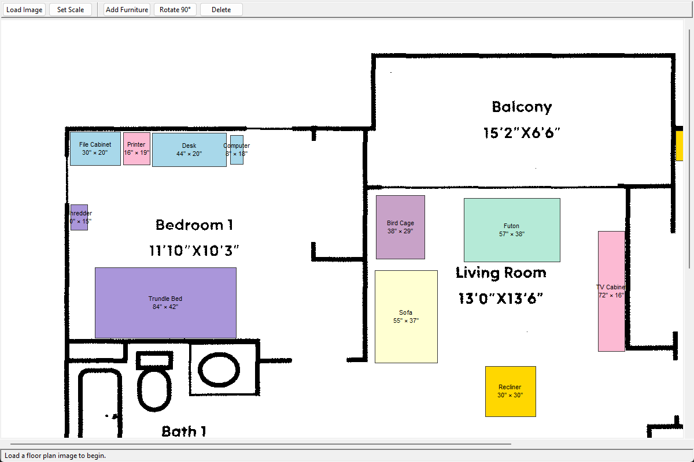

# Furniture Layout



A desktop GUI for arranging furniture on a floor plan. Load a floor plan image,
calibrate the scale to real-world dimensions, then drag and rotate furniture
rectangles to plan your room layout.

## Requirements

- Python 3.14+
- Pillow (installed automatically via pip)

## Setup

```bash
pip install -r requirements.txt
```

## Running

```bash
python main.py
```

## Usage

### 1. Load a floor plan image

Click **Load Image** and select a PNG, JPG, or other image file of your floor plan.
The image is displayed at its native pixel size in a scrollable canvas.

### 2. Set the scale

Click **Set Scale** and enter the real-world width of the floor plan in feet and inches.
The dialog shows the computed height so you can verify the scale looks correct before confirming.

Scale is stored as pixels per inch. All furniture dimensions are converted to pixels
using this scale.

### 3. Add furniture

Click **Add Furniture**, enter a name and dimensions (width and depth in feet + inches),
and click OK. The item appears as a labeled rectangle in the center of the visible canvas.

### 4. Move furniture

Click and drag any furniture rectangle to reposition it. Items are clamped to the
bounds of the floor plan image.

### 5. Rotate furniture

Select an item and:
- Press **R** to rotate 90° clockwise
- Click **Rotate 90°** in the toolbar
- Right-click → **Rotate 90°**
- **Shift + scroll wheel** for free rotation in 5° increments

### 6. Edit or delete furniture

- **Double-click** a rectangle to edit its name or dimensions
- **Right-click** for a context menu (Edit, Rotate, Bring to Front, Send to Back, Delete)
- Press **Delete** to remove the selected item

### 7. Save and reload layouts

- **Ctrl+S** — save the current layout (furniture positions, rotations, and scale) to a JSON file
- **Ctrl+O** or **File → Open Layout** — reload a saved layout

The image path is stored relative to the JSON file, so layouts are portable as long as
the image stays in the same relative location.

### 8. Print the layout

**Ctrl+P** or **File → Print Layout…** renders the floor plan and all furniture onto a
single Letter-size page, scaled to fit, and sends it to the default printer. Requires an
image to be loaded and the scale to be set. Printing is only supported on Windows.

## Keyboard Shortcuts

| Key | Action |
|-----|--------|
| R | Rotate selected item 90° |
| Delete | Delete selected item |
| Ctrl+S | Save layout |
| Ctrl+O | Open layout |
| Ctrl+P | Print layout |
| Shift+Scroll | Free-rotate selected item (5° increments) |
| Scroll wheel | Scroll canvas vertically |

## File Structure

```
FurnitureLayout/
├── main.py           # Entry point
├── app.py            # Main window, toolbar, menu, status bar
├── canvas_view.py    # Interactive canvas (rendering, drag, rotation)
├── furniture.py      # FurnitureItem dataclass and rotation geometry
├── dialogs.py        # Scale, Add, and Edit dialogs
├── layout_manager.py # JSON save/load
├── print_layout.py   # Render layout to a single page and send to printer
└── requirements.txt
```
